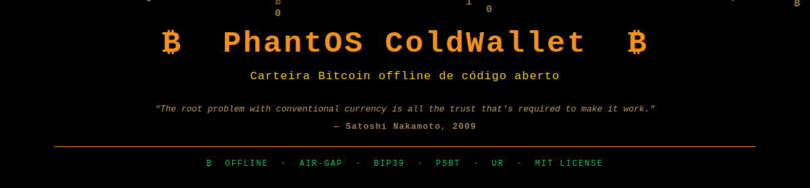
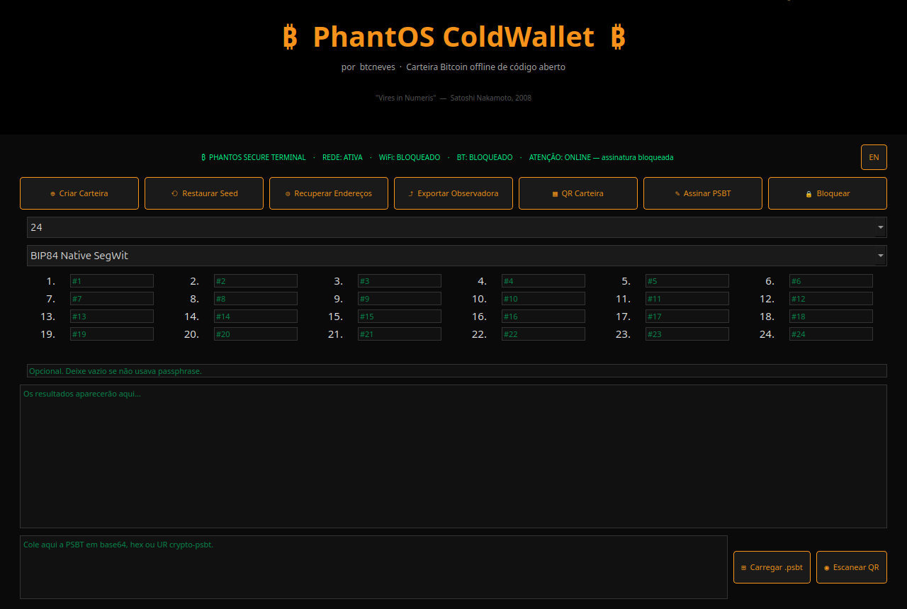
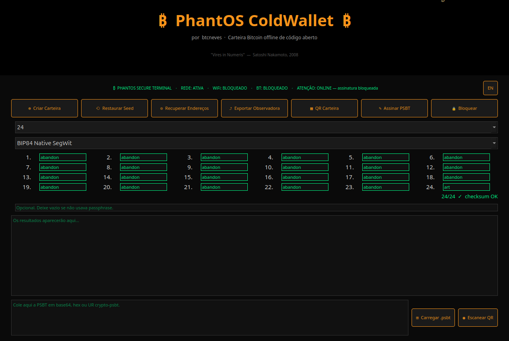
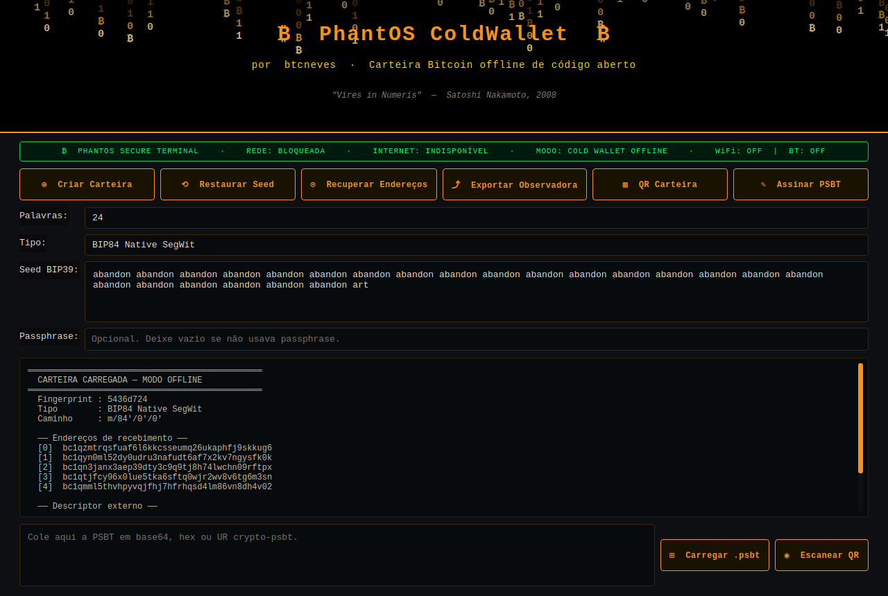
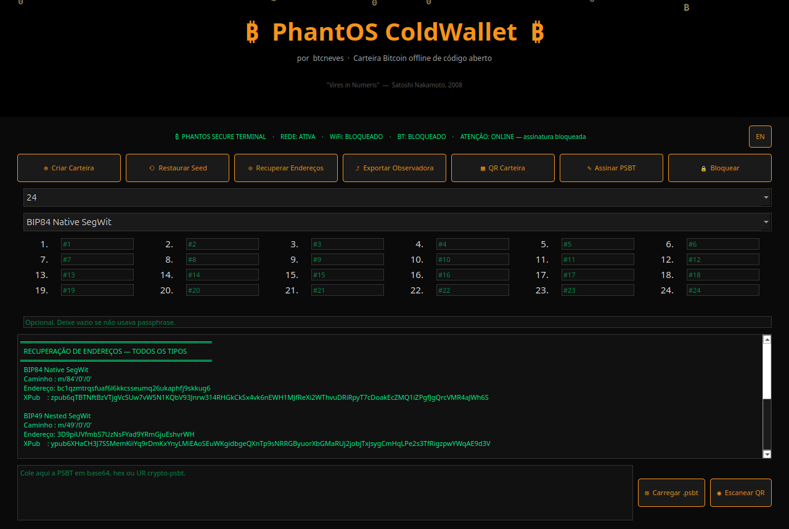
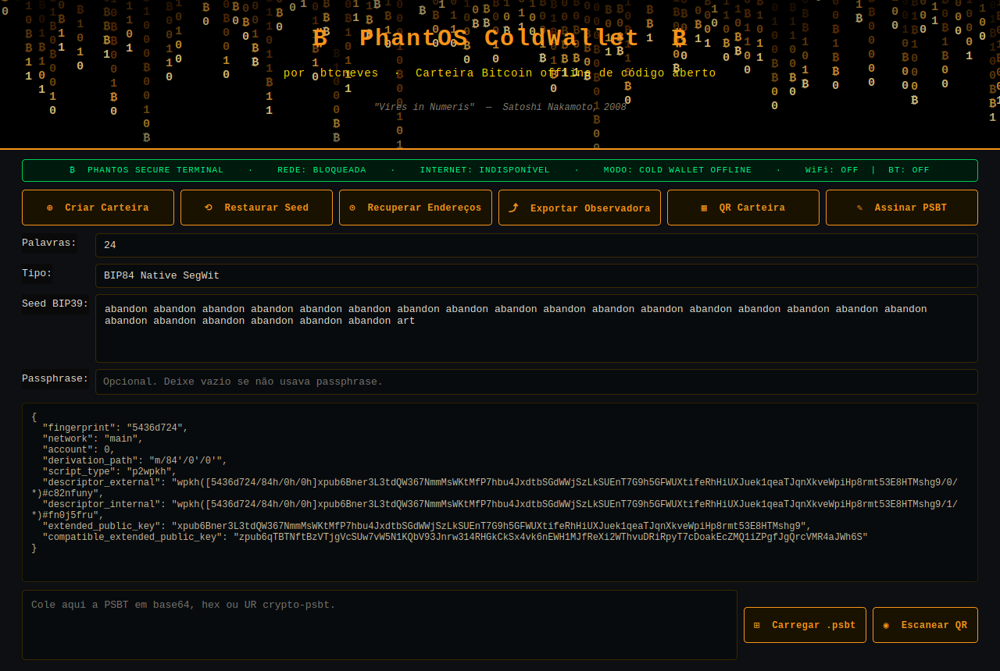
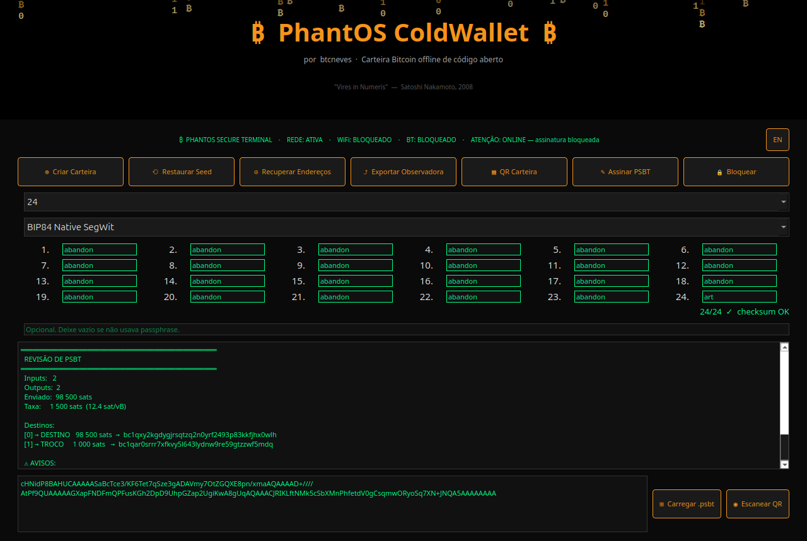
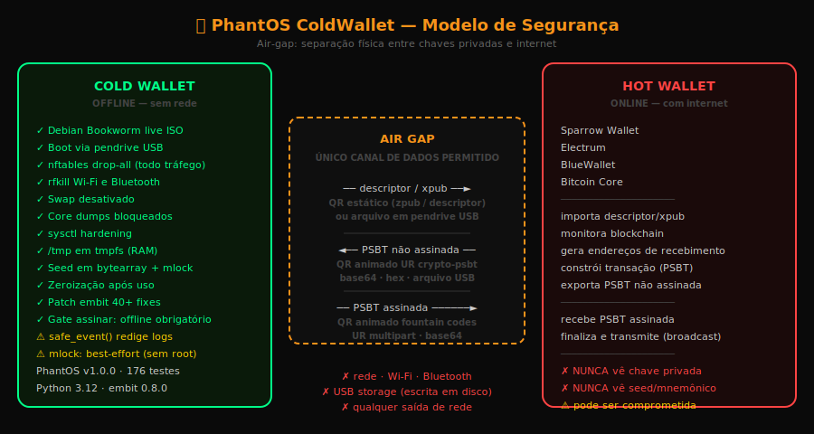
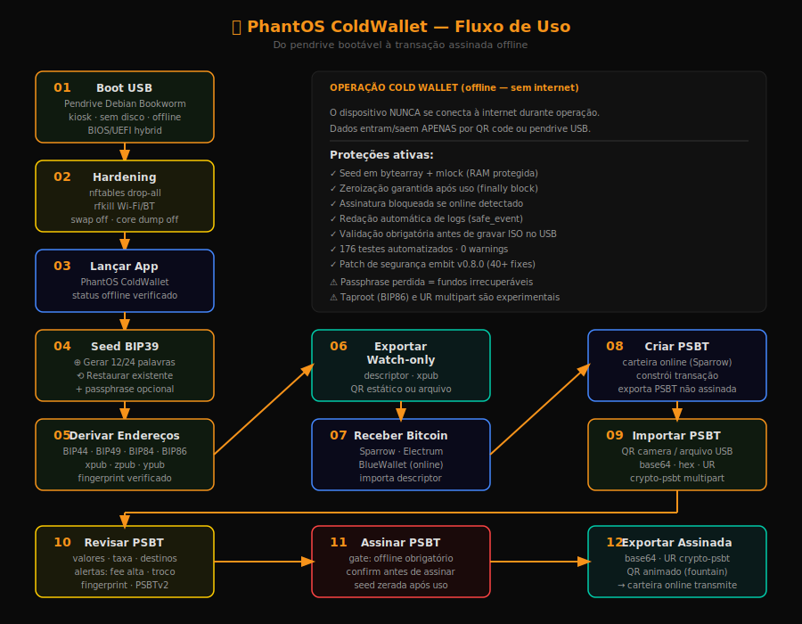

# PhantOS ColdWallet

[](README.md) [](README_EN.md)



[](LICENSE)
[](https://www.python.org/)
[](https://bitcoin.org)
[](tests/)
[](CHANGELOG.md)

---

> *"The root problem with conventional currency is all the trust that's required to make it work."*  —  Satoshi Nakamoto, 2009

**Cold wallet Bitcoin open-source para qualquer pessoa. Boot do pendrive, restaure sua seed, derive endereços, assine transações offline e desligue. Nada salvo em disco. Tudo offline.**

---

## Screenshots














---

## Descrição

PhantOS ColdWallet é uma carteira fria Bitcoin para uso offline, executada diretamente de um pendrive bootável (Debian Bookworm live). Gera e restaura seeds BIP39, deriva endereços em múltiplos padrões (Legacy, SegWit, Taproot), assina PSBTs offline e exporta QR/UR para integração com carteiras quentes como BlueWallet e Sparrow.

---

## Recursos Principais

- **Geração de seed BIP39** — 12 ou 24 palavras com entropia do sistema (`secrets.token_bytes()`)
- **Restauração de carteira** — seed + passphrase BIP39 opcional
- **Derivação multi-padrão** — BIP44 (Legacy), BIP49 (Nested SegWit), BIP84 (Native SegWit, padrão), BIP86 (Taproot, experimental)
- **Exportação watch-only** — fingerprint, xpub/zpub/ypub, descriptors completos
- **Assinatura PSBT offline** — parse, revisão e assinatura com alertas de segurança
- **Alertas de PSBT** — taxa alta, troco não reconhecido, fingerprint divergente
- **QR simples** — exportação de xpub e descriptors como QR estático
- **UR `crypto-psbt`** — single-part e multipart no core; interoperabilidade externa ainda em validação
- **Scan QR por câmera** — importação de PSBT diretamente pela webcam
- **Interface dark Bitcoin** — laranja `#F7931A`, fundo `#0A0A0A`, tipografia monospace
- **Bilinguismo** — Português (pt_BR) e Inglês (en_US) alternaveis em tempo real
- **Hardening de rede** — Wi-Fi e Bluetooth desabilitados, `nftables` drop-all
- **Bootável via pendrive** — live Debian Bookworm, openbox kiosk, autologin
- **188 testes automatizados** — ruff, mypy e pytest na validação local e no CI, 0 warnings

---

## Modelo de Segurança



O PhantOS implementa isolamento por air-gap: chaves privadas **nunca saem** do dispositivo offline. A comunicação com carteiras online ocorre exclusivamente por QR code ou arquivo USB.

**Camadas de proteção:**

| Proteção | Descrição |
| --- | --- |
| Seed em memória protegida | `bytearray` + `mlock()` — evita swap para disco |
| Zeroização garantida | `zero_bytearray()` em bloco `finally` |
| Gate de assinatura | Bloqueia se qualquer interface de rede estiver ativa |
| Redação de logs | `safe_event()` remove termos sensíveis de todos os logs |
| Patch embit v0.8.0 | 40+ vulnerabilidades corrigidas (A-01 a A-09, CRYPTO-01 a CRYPTO-09) — aplicado automaticamente pelo `build_iso.sh` durante o build da ISO |
| SO endurecido | swap off, core dumps off, sysctl hardening, `/tmp` em tmpfs |

---

## Fluxo de Uso



1. **Gravar ISO no pendrive** — use `dd` ou Balena Etcher com a ISO gerada
2. **Bootar o computador** pelo pendrive (F12/F2/Del para menu de boot)
3. **Selecionar operação** na tela inicial: nova seed, restaurar ou revisar PSBT
4. **Gerar ou restaurar seed** — exibida apenas na tela, nunca salva em disco
5. **Verificar endereços** gerados e confirmar o padrão de derivação desejado
6. **Exportar watch-only** — escanear descriptor ou xpub em carteira observadora
7. **Receber Bitcoin** via carteira quente conectada à internet
8. **Importar PSBT** para assinatura — via câmera ou arquivo USB
9. **Revisar e assinar** — conferir valores, taxa e destinos antes de assinar
10. **Exportar PSBT assinada** — base64 e UR `crypto-psbt` para transmissão pela carteira online

---

## Arquitetura


```text
app/
  descriptors/   — montagem de descriptors Bitcoin (BIP44/49/84/86)
  i18n/          — internacionalização (pt_BR, en_US)
  psbt/          — parse, revisão e assinatura de PSBT
  qr/            — geração e leitura de QR (qrcode, zxing-cpp)
  security/      — status offline, mlock, safe_event
  ui/            — interface PySide6 (dark Bitcoin theme); dialogs.py — wrappers frameless centralizados
  ur/            — UR encoding crypto-psbt (Foundation Devices)
  wallet/        — núcleo BIP39/BIP32
assets/
  diagrams/      — architecture.svg · usage-flow.svg · security-model.svg
  screenshots/   — capturas reais de todas as telas
  logo/          — banner.gif
docs/            — tutoriais, guias de integração, threat model
scripts/         — build_iso.sh · write_usb.sh · harden_network.sh
patches/         — embit-0.8.0-phantos-security.patch (40+ fixes)
tests/           — 188 testes automatizados (0 warnings)
```

---

## Início Rápido (Desenvolvimento)

### Pré-requisitos

- Python >= 3.11 (o CI e a versão de desenvolvimento usam Python 3.12)
- Git

### Instalação

```bash
git clone https://github.com/btcneves/phantos-coldwallet.git
cd phantos-coldwallet

python -m venv .venv
source .venv/bin/activate

pip install -e ".[dev]"

# Aplicar patch de segurança embit (obrigatório)
bash scripts/apply_embit_patch.sh
```

### Executar a aplicação

```bash
python -m app.main
```

### Executar testes

```bash
pytest tests/ -v
```

### Lint e verificação de tipos

```bash
ruff check .
mypy app/
```

---

## Gerar ISO Bootável

> Requer Ubuntu ou Debian com `live-build` instalado.

```bash
sudo apt install live-build debootstrap xorriso grub-efi-amd64-bin grub-pc-bin dosfstools rsync dpkg-dev
sudo bash scripts/build_iso.sh
```

A ISO será gerada como `phantos-coldwallet-1.0.0-amd64.iso` na raiz do repositório.

> Consulte `docs/` para detalhes sobre personalização do ambiente live.

---

## Gravar no Pendrive

Substitua `/dev/sdX` pelo dispositivo correto (verifique com `lsblk`).

```bash
sudo PHANTOS_CONFIRM_WIPE="CONFIRMO APAGAR ESTE DISPOSITIVO" \
     PHANTOS_ISO_SHA256="<sha256 da iso>" \
  bash scripts/write_usb.sh phantos-coldwallet-1.0.0-amd64.iso /dev/sdX
```

Ou use [Balena Etcher](https://etcher.balena.io/) para uma interface gráfica.

---

## Compatibilidade

| Carteira | Status validado | Observação |
| --- | --- | --- |
| Bitcoin Core | PASS em regtest via Docker | PSBT roundtrip |
| Sparrow Wallet | PASS | Import de descriptor e export de PSBT validados |
| Electrum | PASS | Import xpub/ypub/zpub e export de PSBT validados |
| BlueWallet | PASS | Watch-only mobile e fluxo PSBT validados |
| Keystone/Passport/Specter | SKIPPED | UR externo ainda não validado |

---

## Stack Técnica

| Componente | Biblioteca |
| --- | --- |
| Interface | PySide6 6.11.1 |
| BIP32/BIP39 | embit 0.8.0 (+ patch segurança) |
| Bitcoin | btclib, python-bitcointx |
| QR | qrcode, Pillow, zxing-cpp |
| UR encoding | urtypes |
| Testes | pytest |
| Lint/tipos | ruff, mypy |

---

## CI/CD

O projeto executa as seguintes verificações em cada push e pull request:

| Job | Ferramenta | Descrição |
| --- | --- | --- |
| Lint | ruff | Formatação e análise estática Python |
| Tipos | mypy | Verificação de tipos estáticos |
| Testes | pytest 3.11/3.12 | 188 testes em matriz Python |
| Shell | ShellCheck | Análise estática de scripts shell |
| SAST | Bandit | Análise de segurança Python |
| Deps | pip-audit | Auditoria de dependências |
| Deps | OSV Scanner | Vulnerabilidades conhecidas |
| Secrets | gitleaks | Detecção de segredos |

---

## ⚠️ Aviso de Segurança

> **LEIA COM ATENÇÃO ANTES DE USAR**

- **v1.0.0** — primeira release pública estável; testada manualmente em hardware real
- Diferença em relação a hardware wallets: elas usam hardware dedicado, e algumas usam *secure element*; o PhantOS usa isolamento por SO endurecido (sem disco, sem rede, sem swap, buffer de seed controlado pelo app zerado após uso). Ambos são modelos legítimos de cold wallet, com riscos distintos
- **Passphrase perdida = fundos irrecuperáveis** — sem recuperação possível
- **Taproot (BIP86)** e **UR multipart** são funcionalidades experimentais
- PSBTv2, Taproot e troco não reconhecido exigem revisão manual cuidadosa
- Consulte [AUDIT_READINESS.md](AUDIT_READINESS.md), [VERIFY_RELEASE.md](VERIFY_RELEASE.md) e [KNOWN_LIMITATIONS.md](KNOWN_LIMITATIONS.md)
- Sempre verifique a integridade do pendrive antes de usar em ambiente de produção
- Execute exclusivamente em computadores **sem conexão à internet** durante a operação
- Valide endereços de recebimento em um dispositivo independente

---

## Contribuição

Contribuições são bem-vindas. Consulte o arquivo [CONTRIBUTING.md](CONTRIBUTING.md) para diretrizes de código, testes e pull requests.

```bash
# Antes de enviar um PR
ruff check .
mypy app/
pytest tests/ -v
```

---

## Licença

Distribuído sob a licença [MIT](LICENSE).

Partes do código UR encoding (`app/ur/`) utilizam componentes derivados de bibliotecas open-source de [Foundation Devices](https://github.com/Foundation-Devices), distribuídas sob licença BSD. Consulte os cabeçalhos dos arquivos para detalhes de atribuição.

---

*PhantOS ColdWallet — controle total das suas chaves, sem compromisso com a internet.*
